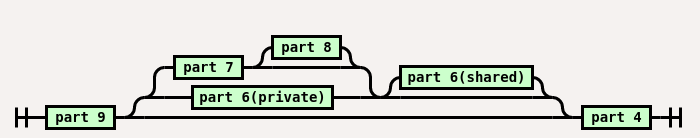
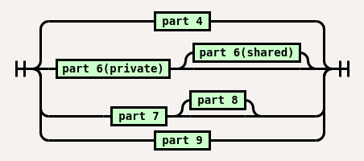
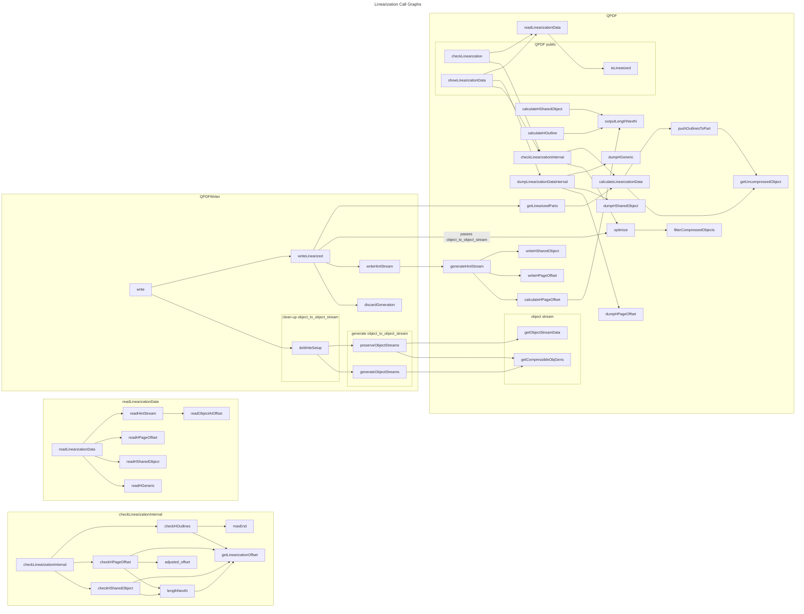

# Random Notes

## Contents

- [ Open questions / outstanding issues ](#open-questions--outstanding-issues)
- [ Changelog / Release Notes ](#changelog--release-notes)
- [ Current PRs ](#current-prs) **updated**
- [ Future PRs](#future-prs)
- [ Project standards ](#project-standards)
  - [ Comment lines ](#avoid-underfull-lines-in-comment-blocks) **new**
- [ QPDFAcroFormDocumentHelper ](#qpdfacroformdocumenthelper)

## Open questions / outstanding issues

### git blame

Should commits correcting doc typos be added to .git-blame-ignore-revs? My view would be yes.

### Add FUTURE build option [#989 ](https://github.com/qpdf/qpdf/pull/989)

Add a CI run with FUTURE option (have a second run of the pikepdf build with the FUTURE option?)?

{To do) Check whether release process in README-maintainer needs to be updated for FUTURE.

### Annotations

- Should repointing the /P entry to the current page be part of fixing the annotation (I don't think it is at the
  moment)?

  - If so, is it worth addressing now or leave it for 'Pages'?

- Should fixing of annotations be part of QPDFPageDocumentHelper and/or QPDF addPage methods?

  - Should this be left for 'Pages'?

## Changelog / Release Notes

- 17 June

  - Bug fix [600](https://github.com/qpdf/qpdf/issues/600)

  - Buffer [draft wording](https://github.com/qpdf/qpdf/pull/983)

## Current PRs

The PRs are listed in the suggested order of review. Ignore any PRs that don't appear on this list.

### Linearization parts [#997 ](https://github.com/qpdf/qpdf/pull/997)

This is a minor issue in itself (I don't think it affects many pdf files that don't /Moo or /Quack) but has an
impact on how to progress [#995](#refactor-linearization-995).

### Add content table to TODO file [#998](https://github.com/qpdf/qpdf/pull/998)

### Add doxygen files to .gitignore [#999](https://github.com/qpdf/qpdf/pull/999)

Two minor house-keeping PRs.

### Refactor linearization [#995 ](https://github.com/qpdf/qpdf/pull/995)

This is WIP

#### Overview of approach - to be expanded and moved to PR when firmed up

- Work with ObjGens for as long as possible. We repeatedly retrieve ObjGens from objects but hardly
  ever use the objects themselves. For objects in object streams, we don't use them at all. It is
  also much cheaper to copy ObjGens, and they are smaller.

- Don't add objects to the object maps that we do not use, especially if we have to remove them
  later (e.g. page objects and root).

- Remove sets as far as possible. Build vectors immediately wherever possible.

- Remove obj_user_to_objects. I don't think it is necessary, but if it turns out to be necessary,
  only build the parts required.

  There are two main uses for them at the moment:

  **purpose 1** in maxEnd / checkHOutlines : calculate the length of the outlines section.

  **purpose 2** for all pages (other than page 1), identify the part 6 and 8 objects used by the
  page.

  It is also currently used for thumbnails, but can be easily replaced for this purpose.


- Use the ordering of ObjUser to facilitate efficient processing. The aim is to eliminate sets in
  object_to_object_users.

- Review the order of scanning in optimize / updateObjectMaps to avoid unnecessary repeated visits
  to the same object.

  optimize has the **purpose 3** of facilitating the allocation of objects to parts as well as
  populating obj_user_to_objects and therefore supporting purposes 1 & 2.

  At the moment, optimize calls updateObjectMaps for each page, each trailer entry and each root
  entry. updateObjectMaps exhaustively scan the object to page boundaries.

##### Allocation of objects to parts

Currently the object maps are populated in optimize and allocation to parts takes place afterwards
in calculateLinearizationData. Consider a scenario where objects are allocated to parts at a first
encounter and are possibly reallocated on subsequent encounters. In this situation the following
rules apply:

- Once an object is allocated to part 4, it cannot be reallocated. Furthermore, all its decendents
  will belong to part 4.

- An object encountered while scanning the first page must ultimately end up in parts 6(private)
  or 6(shared), unless it belongs to part 4. Part 6(private) objects can be reallocated to part 6(
  shared), but not vice versa. All descendents of a part 6(private) object will be part 6(
  private), part 6(shared) or part 4. All descendents of a part 6(shared) object will be part 6(
  shared) or part 4.

- An object encountered while scanning other page must ultimately end up in parts 6(shared), 7 or 8,
  unless it belongs to part 4. Part 6(private) objects can be reallocated to part 6(shared), and
  part 7 objects can be allocated to part 8, but not vice versa. There are similar rules for
  decendents to the rules above.

- All objects not belonging to parts 4, 6, 7 or 8 belong to part 9.

In summary, the only transitions for objects provisionally allocated to parts are up the chain



This suggests that from the perspective of purpose 3, the most efficient order of scanning is:

- all part 4 candidates,
- the first page,
- all other pages,
- all other objects.

Using this order, the transitions simplify to



Furthermore, there is no need to visit any descendents previously identified as belonging to a
higher priority part, as all of them will have at least this higher priority.

Consider only purpose 2 for the moment.

The descendents of a page are its children and their descendents. Once the descendents of a child
have been established there is no need to descend into the child again. Furthermore, if any part 4
objects are encountered there is no need to descend any further as all of their descendents will be
part 4.

##### Object streams

It is likely that many of the objects allocated above are members of object streams, and that the
object streams were generated by qpdf. As this is the most common it would make sense to optimize
for this case, so let us consider this case further.

Currently, prior to calling optimize, QPDFWriter calls getCompressibleObjGens to select objects and
determine their order. Writer then splits the returned objects into approximately equal (by object
count) streams and then calls optimize with a object / stream mapping.

To select the objects, getCompressibleObjGens has to walk the entire object tree in much the same
way as optimize does. It appears that:

- getCompressibleObjGens and optimize can be combined so that only a single pass over the object
  tree is required. Even as it stands at the moment, the object / stream mapping is only required
  after optimize has completed its pass over the object tree.

- there is nothing preventing us from tweaking the object order outlined in the previous section.
  This does not only have the benefit outlined in the previous section, but also allows us to know
  the object stream of each object as we process it. Therefore there is no need for the extra pass
  currently happening in filterCompressedObjects. 

- there is nothing preventing us fixing the allocation of objects to streams to ensure that in
  practically all cases all objects associated with the first page are in a single object stream,
  and that there are no part 7 object streams. This implies that only part 



#### Open questions

1. optimize is an exported function that takes object_to_object_stream as a parameter.
  - how can that be used by anything other than QPDFWriter?

   At the moment I can't see a need to call optimize except from the linearizer part of QPDF and
   QPDFWriter. This suggests creating a QPDF::Linearizer class and possibly giving QPDFWriter
   privileged access to it.

1. generateObjectStreams tries to create equal size streams of not more than 100 objects. I did see
   anything in the spec mentioning either of the features. Is this just a heuristic to achieve the
   general objectives outlined in spec or are there other reasons for picking that particular
   solution?

   The generation of object streams and linearization are closely related. Also, generation of 
    object streams logically belongs to the QPDF class rather than QPDFWriter.

The considerations from the perspective of purpose 1 are similar to those of purpose 2.

- Replace the 'part' vectors with vectors of 'sub-part' vectors to avoid unnecessary copying.

- Make object_to_object_users a vector rather than a map for relatively dense object caches.

### Code tidy classes QPDF and QPDFObjectHandle [#972 ](https://github.com/qpdf/qpdf/pull/972)

As mentioned in #982 this is essentially on hold while I am dealing with rules that can be resolved with a
single, more or less mechanical solution.

For the moment the only points worth looking at are the open questions raised earlier:

- Should the public part of the header should have individual ```// NOLINT``` annotations or should the whole public
  section be bracketed with
  ```
  // NOLINTBEGIN (modernize-use-nodiscard) ABI
  ...
  // NOLINTEND (modernize-use-nodiscard)
  ```

  pairs as in eg [8dd1929](https://github.com/qpdf/qpdf/pull/972/commits/8dd1929eef323424bb3ab79410649df4a25c013b)
  lines 53 and 721. I would lean towards the latter as I don't see any significant benefit in the former.

- Do we want to do any clean-up of declarations of exported methods at the moment. While things likely adding
  attribute [[nodiscard]] should not cause problems is the benefit worth the risk? How confident are we that
  abi-perf-test will detect all possible issues. I would lean towards suppressing warnings for the moment and
  dealing with those parts of the header files when we are ready to break ABI.

### Add const overloads for various QPDFObjectHandle methods [#979 ](https://github.com/qpdf/qpdf/pull/979)

WIP - This PR was triggered by the work on Clang-Tidy rule performance-for-range-copy.

As a result of pushing all state from QPDFObjectHandle down to QPDFObject and QPDFValue most of the QPDFObjectHandle
method that in the past had to be non-const because of the possibility that they would trigger object resolution can
now be const. This has significant benefits including allowing range based for loops to be optimized.

Switching to const methods allows us to create a replacement for QPDFObjectHandle::ditems that outperforms both ditems
and getDictAsMap.

(TODO - expand)

## Future PRs

### Use result unpacking in range based for loop over maps

i.e. use

```cpp
for (auto const& [key, value]: oh.dItems()){
    // ...
}
```

When I looked at this last time it had a noticeable negative performance impact. On Clang-15, using it has a tiny
but statistically significant performance improvement. For GCC-12 there is a greater improvement (but also still
very small)

(Timings 10 Jun 2023 18:49:42, 10 Jun 2023 20:28:02)

### Fix comments in example pdf-invert-images

Some of the comments apply to pointer holder, but not necessarily std managed pointers.

local branch `example`

### Tune QPDFParser

#### Avoid creating QPDF_Name objects for dictionary keys

This has a significant positive performance impact.

Local branch `nparse`

#### Avoid creating QPDF_Integer objects for indirect references

Not checked, but in view of above is likely to have a positive performance impact.

#### Create dictionaries on the fly

Rather than pushing object into a std::vector and building a std::map at the end, add a map to the StackFrame and add
entries as we go along.

This has a positive performance impact, but it is slightly tricky to deal with missing keys.

local branch `nparse`

### Remove double indirection from QPDFObject/QPDFValue

local branch `var4_12b`

## Project standards

### Avoid underfull lines in comment blocks

I suggest we ensure that lines in comment blocks are always filled. clang-format does a good job of
reflowing comments with full lines, even if some of them are short because of long words. Any lines
shorter than necessary are treated as having a deliberate line-break, which will be preserved.

This requires that when shortening comments the edited line is joint with a neighboring line to make
it longer than 100 chars, followed by reflowing using clang-format.

Example:
```cpp
// Blaaah blaaaah  blaaaah blaaaah blaaaah blaaaah blaaaah blaaaah blaaaah blaaaah blaaaah blaaaah
// blaaaah blaaaah blaaaah blaaaah blaaaah blaaaah blaaaah blaaaah blaaaah blaaaah blaaaah add some example text and reformat afterwards
// blaaaah blaaaah blaaaah blaaaah  blaaaah blaaaah blaaaah blaaaah blaaaah blaaaah blaaaah blaaaah
// blaaaah blaaaah blaaaah  blaaaah blaaaah blaaaah blaaaah blaaaah blaaaah  blaaaah blaaaah blaaaah
// blaaaah  blaaaah blaaaah blaaaah blaaaah blaaaah blaaaah blaaaah
// loooooooooooooooooooonnnnnnnnnnnnnnnnnnnnnnnnnnnnnnnnnng  blaaaah blaaaah blaaaah blaaaah blaaaah
// blaaaah blaaaah blaaaah blaaaah  blaaaah blaaaah blaaaah blaaaah blaaaah blaaaah blaaaah blaaaah
// blaaaah blaaaah blaaaah  blaaaah blaaaah blaaaah blaaaah blaaaah blaaaah
// *  blaaaah blaaaah blaaaah blaaaah blaaaah blaaaah blaaaah blaaaah blaaaah blaaaah blaah blaaaah
//    blaaaah blaaaah blaaaah blaaaah  blaaaah blaaaah blaaaah blaaaah blaaaah blaaaah add some more extensive example text and reformat afterwards
//    blaaaah blaaaah blaaaah blaaaah blaaaah blaaaah blaaaah blaaaah blaaaah blaaaah blaaaah
//    blaaaah blaaaah blaaaah blaaaah blaaaah blaaaah blaaaah blaaaah
//    loooooooooooooooooooonnnnnnnnnnnnnnnnnnnnnnnnnnnnnnnnnng blaaaah blaaaah blaaaah  blaaaah
//    blaaaah blaaaah blaaaah blaaaah blaaaah blaaaah blaaaah blaaaah blaaaah blaaaah blaaaah
//    blaaaah blaaaah blaaaah blaaaah blaaaah blaaaah blaaaah blaaaah blaaaah blaaaah
```
reflows to:
```cpp
// Blaaah blaaaah  blaaaah blaaaah blaaaah blaaaah blaaaah blaaaah blaaaah blaaaah blaaaah blaaaah
// blaaaah blaaaah blaaaah blaaaah blaaaah blaaaah blaaaah blaaaah blaaaah blaaaah blaaaah add some
// example text and reformat afterwards blaaaah blaaaah blaaaah blaaaah  blaaaah blaaaah blaaaah
// blaaaah blaaaah blaaaah blaaaah blaaaah blaaaah blaaaah blaaaah  blaaaah blaaaah blaaaah blaaaah
// blaaaah blaaaah  blaaaah blaaaah blaaaah blaaaah  blaaaah blaaaah blaaaah blaaaah blaaaah blaaaah
// blaaaah loooooooooooooooooooonnnnnnnnnnnnnnnnnnnnnnnnnnnnnnnnnng  blaaaah blaaaah blaaaah blaaaah
// blaaaah blaaaah blaaaah blaaaah blaaaah  blaaaah blaaaah blaaaah blaaaah blaaaah blaaaah blaaaah
// blaaaah blaaaah blaaaah blaaaah  blaaaah blaaaah blaaaah blaaaah blaaaah blaaaah
// *  blaaaah blaaaah blaaaah blaaaah blaaaah blaaaah blaaaah blaaaah blaaaah blaaaah blaah blaaaah
//    blaaaah blaaaah blaaaah blaaaah  blaaaah blaaaah blaaaah blaaaah blaaaah blaaaah add some more
//    extensive example text and reformat afterwards blaaaah blaaaah blaaaah blaaaah blaaaah blaaaah
//    blaaaah blaaaah blaaaah blaaaah blaaaah blaaaah blaaaah blaaaah blaaaah blaaaah blaaaah
//    blaaaah blaaaah loooooooooooooooooooonnnnnnnnnnnnnnnnnnnnnnnnnnnnnnnnnng blaaaah blaaaah
//    blaaaah  blaaaah blaaaah blaaaah blaaaah blaaaah blaaaah blaaaah blaaaah blaaaah blaaaah
//    blaaaah blaaaah blaaaah blaaaah blaaaah blaaaah blaaaah blaaaah blaaaah blaaaah blaaaah
//    blaaaah
```

### Markdown

I would suggest we use for Markdown a default indentation / tab width of 2 characters (rather than the 4 char
default in CLion).

## QPDFAcroFormDocumentHelper

Some thoughts / questions:

- is there ever a need to have more than one QPDFAcroFormDocumentHelper per QPDF object, or for that matter, for
  creating a new instance when there was a previous instance. If not, it would seem to make sense to cache the
  helper in the QPDF object and reuse it if a new one is requested. I see a number of potential benefits:

  - performance

  - error handling

    The nature of the errors detected by the analyze method is different on a first run and on
    subsequent runs. On a first run they indicate problems with the input file that should be fixed
    and reported while on subsequent runs they would indicate programmer errors and therefore
    probably should throw a logic error.

  - convenience

    Users don't have to implement caching of the helpers for performance reasons themselves.


##### Resources

###### Railroad diagrams

Online [tool](https://www.xanthir.com/etc/railroad-diagrams/generator.html)

Diagram 995_1:
```python
Diagram(
    NonTerminal('part 9'),
    Choice(1,
           Sequence(
               Choice(1,
                      Sequence(
                          NonTerminal('part 7'),
                          Choice(1,
                                 NonTerminal('part 8'),
                                 Skip())),
                      NonTerminal('part 6(private)')),
               Choice(1,
                      NonTerminal('part 6(shared)'),
                      Skip())),
           Skip()),
    NonTerminal('part 4'))
```

Diagram 995_2:
```python
Diagram(
    Choice(1,
           NonTerminal('part 4'),
           Sequence(
               NonTerminal('part 6(private)'),
               Choice(1,
                      NonTerminal('part 6(shared)'),
                      Skip())),
           Sequence(
               NonTerminal('part 7'),
               Choice(1,
                      NonTerminal('part 8'),
                      Skip())),
           NonTerminal('part 9')
           ))
```


**END**
