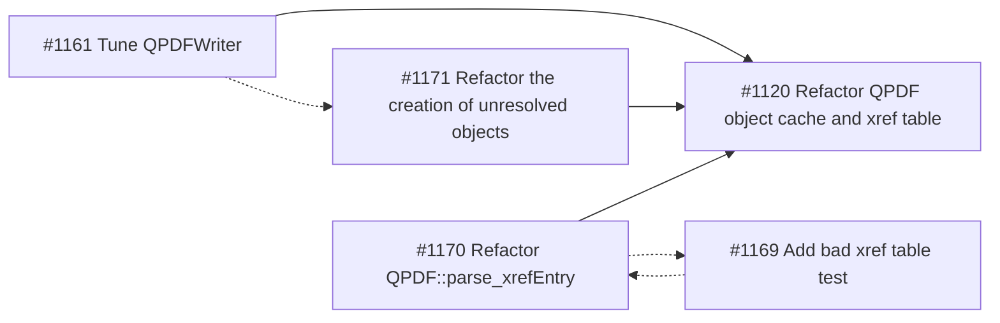

# Pull Requests

## Refactor QPDF object cache and xref table

This work has four aims:

- simplify the existing code for maintainability
- enforce validity (namely a single object per object id)
- prepare for support of incremental updates
- improve performance

My initial stab is in #1120. This is now stale and will require a complete rework.

#1161 is the result of my second attempt and ready for a full review with a view of using the same approach for the
object cache and xref table.

The main idea of the rewrite is to store the object data required by QPDFWriter as far as possible in vectors rather
than maps, and to combine containers where it makes sense. Taking this approach improves performance by over 10% on
clang-15.

The major problem encountered during the work are dangling references with large object ids ( >> max xref table entry).
These are typically the result of damaged files, including files generated during fuzzing. My understanding of the spec
is that such references are ultimately equivalent to a direct null and should be treated as such by a conforming reader.
Doing so would have a number of advantages, including having qpdf running out of object ids when it encounters a very
large dangling reference as well as removing the need for qpdf to read a complete pdf file before it can create a new
(indirect) object. The question of how dangling references should be handled is also important for future support of
incremental updates.

The dangling references problem is part of the motivation behind #1171. The basic idea is that it only makes sense to
create an unresolved object for objects that are present in the xref table as by defintion all other objects are
unresolvable and therefore are the null object. The approach taken is to check the xref table when trying to retrieve
a non-extisting object from the object cache. The alternative approach of populating the object cache with unresolved
objects as the xref table is parsed has a negative performance impact - however, this may change once the object cache
implementation is based on vectors and will need to be reviewed.

To efficiently implement the object cache based on std::vector it is necessary to establish the size of the xref table
before populating it, which will require some refactoring of the parsing of the xref table. In particular, it will
require trying to find the trailer early in the process. This should be fast for valid xref tables and therefore it
makes sense to optimistically parse on the assumption that the xref table is valid until proven otherwise. #1170 is
prepatory work for this, but it also has a positive performance impact for short qpdf jobs. During the work on #1170 I
encountered one case of invalid xref entries that is currently not reported by qpdf. #1169 is a test case for this.
Depending on what you decide #1170 may need some tweaking.

